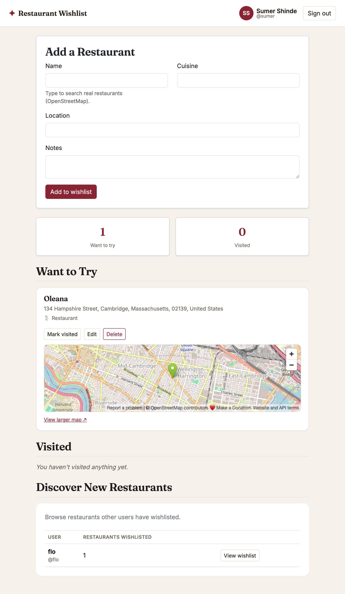

# Restaurant Wishlist

A full-stack web app that lets food enthusiasts save, organize, and share
restaurants they want to visit. Keep a personal wishlist of places to try, jot
down notes, and check them off with a short review once you've been.

Deployed website: https://restaurant-wishlist.onrender.com

## Author

- **Sumer Shinde** - US-01 (profile & wishlist CRUD) and US-02 (mark as visited)
- **Catherine Han** - US-03 (browse other users' wishlists) and US-04 (save from another list)

## Class Link

CS5610 Web Development - Northeastern University.
Course page: https://johnguerra.co/classes/webDevelopment_online_summer_2026/

## Project Objective

Restaurant Wishlist is half personal tracker, half community recommendation
engine. A user creates a profile, builds a wishlist of restaurants (name,
cuisine, location, and notes), edits or removes entries, and marks places as
visited with an optional review. Visited and unvisited restaurants are shown in
separate sections so it's easy to see where you've been and where you still
want to go.

The app is built with vanilla JavaScript on the client and a Node + Express API
backed by MongoDB. Both the client and server code are organized into small,
single-responsibility modules.

## Screenshot



## Tech Stack

- **Frontend:** Vanilla JavaScript (ES modules), HTML, CSS, Fetch API. Bootstrap
  5 (CSS only, via CDN) handles layout and base components; per-module CSS files
  add the custom theme. No Bootstrap JS is used — all interactivity is vanilla.
- **Backend:** Node.js + Express
- **Database:** MongoDB (collections: `users`, `restaurants`, `wishlists`)
- **Maps & search:** [OpenStreetMap](https://www.openstreetmap.org) — the
  [Photon](https://photon.komoot.io) geocoder powers live restaurant search /
  address autofill, and an embedded OSM map shows each saved place on a pin.
- **Weather:** live conditions at each saved restaurant via
  [Open-Meteo](https://open-meteo.com). All of the above are free and need **no
  API key**.

## Project Structure

```
.
├── server.js              # Express app entry point
├── db/
│   └── connection.js      # MongoDB connector module
├── utils/
│   └── password.js        # Password hashing (scrypt) module
├── routes/
│   ├── users.js           # Register + login endpoints (US-01)
│   └── wishlist.js        # Wishlist CRUD + visited (US-01, US-02)
│   └── browse.js          # View/save other wishlist entries (US-03, US-04)
└── public/
    ├── index.html
    ├── css/               # One stylesheet per module
    │   ├── base.css
    │   ├── profile.css
    │   ├── wishlist.css
    │   ├── browse.css
    │   ├── places.css
    │   └── modal.css
    └── js/                # One module per concern
        ├── api.js         # Fetch wrapper
        ├── profile.js     # Account auth (sign in / register / sign out)
        ├── wishlist.js    # Wishlist UI (+ map rendering)
        ├── browse.js      # View/save other wishlist entries UI
        ├── places.js      # OpenStreetMap restaurant search (autofill)
        ├── weather.js     # Open-Meteo current-weather lookups
        ├── modal.js       # Reusable confirm / review dialog
        └── main.js        # Wires the modules together
```

## Instructions to Build & Run

1. **Clone the repo and install dependencies:**

   ```bash
   git clone <repo-url>
   cd Restaurant-Wishlist
   npm install
   ```

2. **Create a `.env` file** in the project root with your MongoDB Atlas
   credentials (this file is git-ignored and never committed):

   ```
   MONGO_USER=your_db_user
   MONGO_PASSWORD=your_db_password
   MONGO_CLUSTER=your-cluster.xxxxx.mongodb.net
   MONGO_DB=restaurant_wishlist
   PORT=3000
   ```

   The database should contain three collections: `users`, `restaurants`, and
   `wishlists` (they are created automatically on first write if they don't
   exist).

3. **Start the server:**

   ```bash
   npm start          # or: npm run dev   (auto-restart on changes)
   ```

4. Open <http://localhost:3000> in your browser.

## Usage

1. Create an account with a display name, username, and password - or sign back
   in with your username and password. Passwords are hashed (scrypt) before
   being stored; the raw password is never saved.
2. Add restaurants to your wishlist. Start typing a name to search **real
   restaurants** via OpenStreetMap — pick one to autofill its address and drop a
   map pin on the entry — or just type the details in by hand.
3. Edit or delete any entry.
4. Mark a restaurant as visited and optionally add a short review - it moves to
   the **Visited** section.
5. Browse other users' wishlists, and save any wishlist entry into your own wishlist.
6. Saved places with a location show a **map**, their **category**, and the
   **current weather** there. Can't decide? Hit **🎲 Surprise me** to pick a
   random spot from your Want to Try list.

## Deployment (Render)

The app is a single Node service that serves both the API and the static
frontend, so it can run on any Node host. It is **not** compatible with static
hosts like GitHub Pages, which cannot run the Express server.

To deploy on [Render](https://render.com):

1. **Atlas → Network Access:** add `0.0.0.0/0` so Render's dynamic IPs can
   connect to your cluster.
2. In Render, create a **Web Service** from this repo (or use the included
   [`render.yaml`](render.yaml) blueprint). Settings:
   - Build command: `npm install`
   - Start command: `npm start`
3. Add the environment variables `MONGO_USER`, `MONGO_PASSWORD`, `MONGO_CLUSTER`,
   and `MONGO_DB` in the Render dashboard (the same values as your local `.env`).
   `PORT` is provided by Render automatically.
4. Deploy. Render builds the service and serves it at a public `*.onrender.com`
   URL.

## Formatting

The codebase is formatted with [Prettier](https://prettier.io):

```bash
npm run format
```

## License

[MIT](LICENSE)
